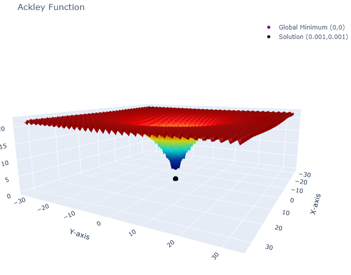
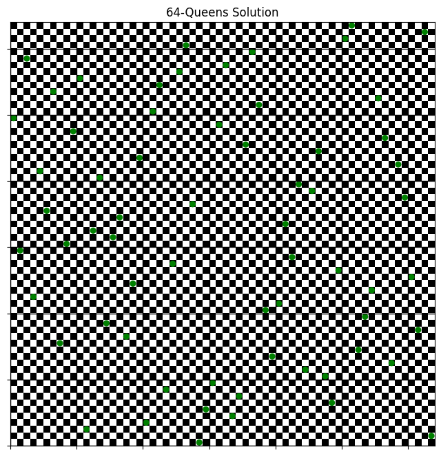

# 🦠 BIOCOMP-project-MAADM-UPM
Bio inspired and evolutionary algorithms applied to different problems. Subject of master´s degree in Machine Learning and Big Data in UPM. 

# 📂 Carpeta "results"
Imágenes de los algoritmos en los distintos problemas (puesto que Plotly con los notebooks en Github no se ve renderizado, pero si se descargan se verán).

# ⚖️ Licencia
Estas evoluciones son legales?

# 👥 Integrantes
* Alejandro Mendoza [@pintamonas4575](https://github.com/pintamonas4575)
* Jaime Álvarez     [@JaimeAlvarez434](https://github.com/JaimeAlvarez434)
* Álvaro Fraile     [@alvarofraile](https://github.com/alvarofraile)

<!--  -->
<!--  -->